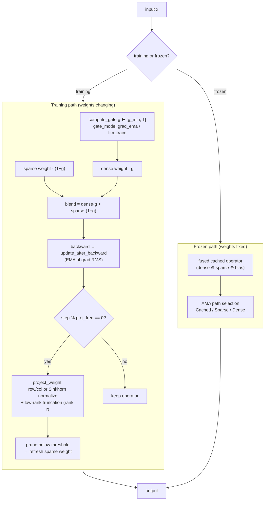
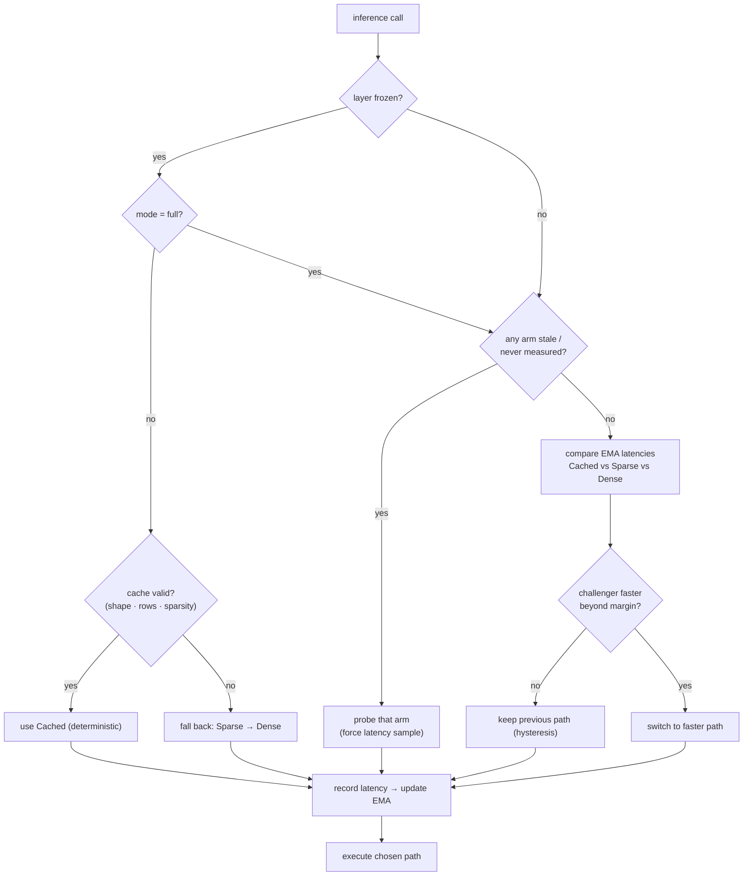
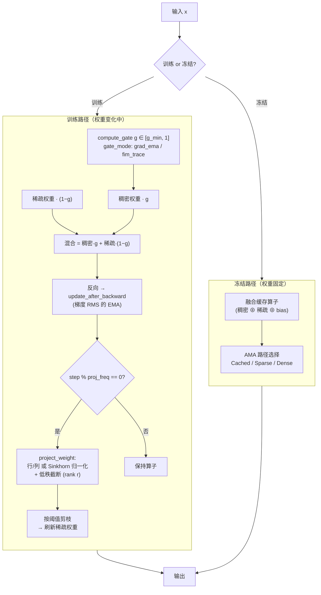
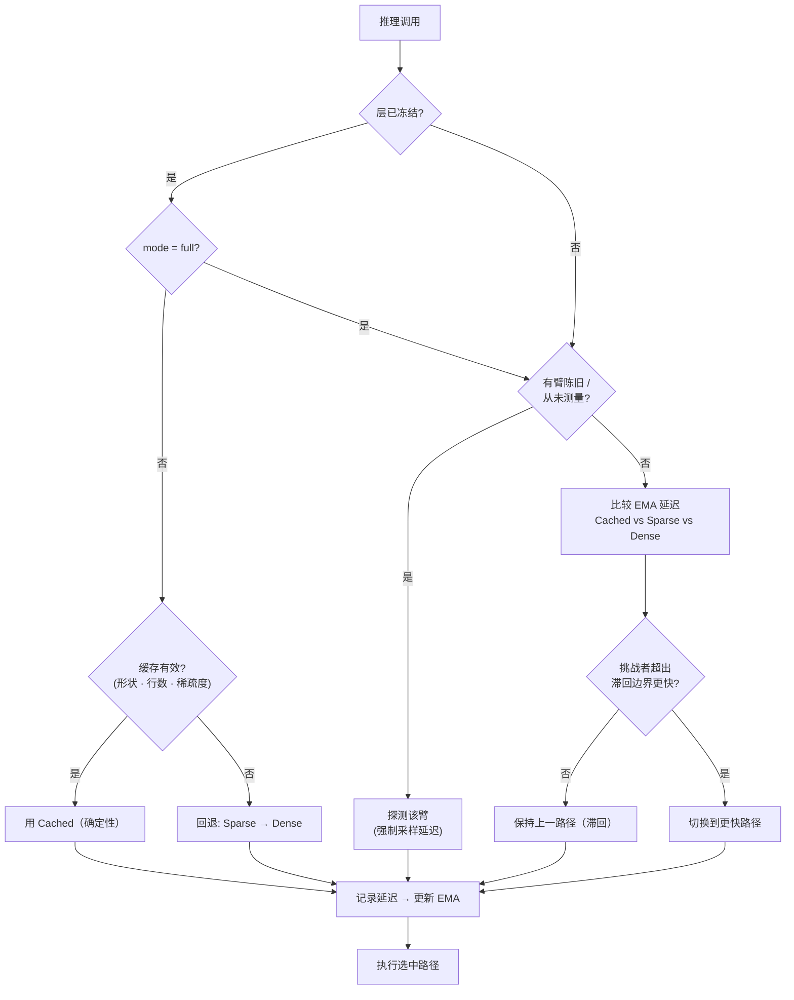

# Talos-XII

[](https://github.com/zayokami/Talos-XII/actions/workflows/ci.yml)
[](https://www.rust-lang.org)
[](https://opensource.org/licenses/MIT)

**A neural network-driven gacha pull simulator for Arknights: Endfield.**

---

Most gacha simulators only roll dice according to a probability table. Talos-XII can additionally run policy-adjusted experiments.

Before a model-driven simulation, Talos-XII loads or trains EnvNet, NeuralLuckOptimizer, DQN, and PPO. EnvNet derives synthetic environment features, while DQN and PPO select one of five discrete luck modifiers under a bounded luck budget. These models do not decide whether to pull or wait; they redistribute the configured per-pull probability inside the simulator. Results therefore describe the selected simulation policy, not undisclosed in-game mechanics.

Technically, Talos-XII is a single Rust binary. It accelerates matrix operations via SIMD (AVX2/AVX-512/NEON) and parallelizes simulation tasks using Rayon, achieving over 10,000 simulations per second on mainstream hardware while maintaining statistical reliability.

---

**由深度学习为基础开发的《明日方舟：终末地》抽卡模拟框架。**
Talos-XII 在模型驱动模拟前加载或训练 EnvNet、NeuralLuckOptimizer、DQN 和 PPO。EnvNet 生成合成环境特征，DQN 与 PPO 在受限运势预算内选择五种离散概率修正动作。模型不会决定是否抽卡，而是在模拟器内部重新分配逐抽概率；结果表示所选模拟策略，不代表未公开的游戏机制。

---

## System Requirements

A CPU-only build runs out of the box on Windows 10+, macOS 11+, and Linux (x86_64 / ARM64, including Apple Silicon and Raspberry Pi). GPU acceleration is optional and requires an NVIDIA GPU (CC 7.5+) with CUDA Toolkit 12.0+.

See **[docs/REQUIREMENTS.md](docs/REQUIREMENTS.md)** for full minimum/recommended specs and per-platform details (runtime deps, SIMD, terminals).

---

## Quick Start

**Build Requirements:** Rust 1.89.0+, 16GB RAM recommended for compilation. CPUs with AVX2 yield best runtime performance.

```bash
git clone https://github.com/zayokami/Talos-XII.git
cd Talos-XII
cargo build --release
./target/release/talos_xii
```

On first launch, the program trains EnvNet, NeuralLuckOptimizer, DQN, and PPO using the schedules in `data/config.json`, taking ~30–45 seconds with the shipped configuration. Models are cached beside the running executable as `env_net.cache`, `neural.cache`, `dqn.cache.bin`, and `ppo.cache.bin`; BF16 inference caches are written to `dqn.cache.bf16.bin` and `ppo.cache.bf16.bin`. Subsequent launches complete in under 1 second.

### CUDA Support (Optional)

Ensure you have an NVIDIA GPU with CC 7.5+ and CUDA Toolkit 12.0+ installed.

```bash
cargo check --features cuda
cargo run --features cuda -- simulate -n 1000 -p 100
```

Set the NVCC target architecture via `CUDA_ARCH`. By default, the build emits
`sm_75` SASS plus `compute_75` PTX for forward-compatible JIT. For Ada GPUs
such as RTX 4060, prefer `sm_89`:

```bash
CUDA_ARCH=sm_86 cargo check --features cuda
CUDA_ARCH=sm_89 cargo build --release --features cuda
```

Control device selection in `data/config.json` via the `device` field:
- `cpu` — force CPU
- `cuda` — prefer CUDA, fall back to CPU if unavailable
- `auto` — auto-detect, prefer CUDA

When the binary is built without the `cuda` feature, `cuda`/`auto` fall back to CPU automatically. Device initialization and fallback reasons are logged at runtime for easy debugging. CUDA paths cover `matmul` (cuBLAS), `relu`/`gelu`/`softmax`/`rmsnorm` (CUDA kernels), and Adam optimizer (GPU kernel). Errors are logged and automatic CPU fallback is applied.

---

## Usage

All subcommands support `-c <path>` for config, `-s <seed>` for repeatable runs with a fixed config and worker topology, and `-f` to force model retraining. Common entry points:

```bash
cargo run --release                              # interactive mode
cargo run --release -- simulate -n 1000 -p 100   # batch simulation
cargo run --release -- f2p                        # F2P UP-probability analysis
cargo run --release -- benchmark                  # quick built-in benchmark
```

See **[docs/USAGE.md](docs/USAGE.md)** for the full command reference — interactive commands, F2P output fields, the optional Python (PyO3) scripting bridge, data collection & model calibration, and the paper-grade ACHF benchmark suite.

---

## Pools & Configuration

Configuration is split into two files, each with field-level documentation in its `_comment` entries:

- **[data/config.json](data/config.json)** — model, training (PPO/DQN/luck-budget), worker, and ACHF parameters.
- **[data/pools.json](data/pools.json)** — all gacha pool definitions. The path is set by `pools_path` in `config.json`.

(For backward compatibility, a `pools` array embedded directly in `config.json` still takes precedence over the external file if present.)

### Pool System

Talos-XII supports four pool types: **character UP** (limited rate-up), **weapon UP** (weapon rate-up), **standard** (regular banner), and **beginner**. Each pool has independent ID, name, UP targets, and probability parameters. In `pools.json`, the `active_pool` field selects the current pool; archived pools (`is_archived: true`) can still be switched to manually for retrospective analysis.

### Probabilities & Pity

Pool rules are data-driven. `data/pools.json` is the canonical source; individual pools may override every probability and pity field.

Shipped active pool contract: `char_up_20260605` uses **50%** (`up_rate = 0.5`). This active character UP pool has a 0.8% base 6-star rate, soft pity at 65, hard pity at 80, and cumulative UP guarantee at 120. Special or archived pools may use different values.

Weapon UP pool: 4% base 6-star rate, hard pity at 40, mega pity at 180, UP weapon rate 50%.

---

## Architecture

### Simulation Engine (`src/sim.rs`)

Each simulation constructs a 32-dimensional feature vector (pity progress, env noise, consecutive non-UP count, engineered interaction terms, etc.) and feeds it to the neural network for decision guidance. Three modes:
- **probability** — historical name for the NeuralLuckOptimizer path; it predicts a bounded luck modifier and is not an unmodified probability baseline
- **dqn** — Dueling Q-Network selects one of five discrete luck modifiers
- **ppo** — Actor-Critic with sequence context selects from the same discrete modifier set

The engine also supports a fast inference path (`fast_inference`) that skips full Tensor construction during batch simulation, using precompiled prediction functions and KV caching to minimize overhead.

### Neural Networks

On first run, four components are trained or loaded sequentially:

1. **EnvNet** (5→64→32→16→2) — models gacha environment noise/bias from RNG, pity, pull count, streak, and loss streak inputs; samples (env_noise, env_bias) per simulation as environment parameters
2. **NeuralLuckOptimizer** — evolutionary training + linear regression + manifold RL on EnvNet-provided environment; learns 32-dim → "luck value" mapping
3. **DQN** (Dueling, 50k steps) — maps state to Q-values over five discrete luck modifiers
4. **PPO** (Actor-Critic + MLA Transformer) — learns a categorical policy over the same five modifiers with sequence context; its schedule is controlled by `ppo_total_steps`

Model cache manifests fingerprint probability, pity, luck-budget, architecture, training, and ACHF settings. Calibrated parameters are applied before this fingerprint is computed. Character-name-only updates can reuse a cache; probability, pity, calibration, feature, architecture, or training changes rebuild incompatible caches on the next initialization. Use `-f` to force retraining.

### ACHF (Adaptive Cache-aware Hyper-Connections)

ACHF is Talos-XII's proprietary training/inference acceleration layer. It replaces a plain dense `Linear` with a self-tuning block that keeps two views of the same operator — a full **dense** weight and a pruned **sparse** weight — and decides at runtime how much of each to use, how often to re-project onto a low-rank manifold, and which physical execution path is actually fastest on the current machine. The goal is to cut the CPU matmul and cache-miss cost that dominates small-batch neural inference, without letting the approximation destabilize training.

The block behaves differently in the two lifecycle phases. **During training** the weights keep changing, so ACHF focuses on the *gate* (how much sparsity to admit) and periodic *manifold projection* (row/column or Sinkhorn normalization + low-rank truncation) that keeps the operator well-conditioned. **After `freeze_for_inference()`** the weights are fixed and ACHF fuses the pruned operator into a cache-friendly form. In `lite` mode inference uses the deterministic frozen fast path; in `full` mode the weights remain frozen but AMA keeps measuring and adapting the physical execution path (see AMA below).



**Problems solved:** CPU-bound neural-network matrix multiplication; cache misses degrading throughput; the fact that the optimal sparsity/projection frequency and even the fastest execution path differ across hardware.

**Four mechanisms:**
- **Low-rank Projection** — row/column or dual (Sinkhorn) projection (`proj_mode`), followed by rank-`r` truncation, replaces the operator with a low-rank approximation that reduces compute and cache pressure (`proj_freq` controls how often it runs; `0` disables it).
- **Gating Sparsity** — a gate value `g ∈ [g_min, 1]` blends dense and pruned weights; channels below threshold are skipped. `g_min` sets a floor so aggressive sparsity can't destabilize the output. The gate is driven by an EMA of gradient RMS (`grad_ema`) or Fisher trace (`fim_trace`).
- **Adaptive Control (AMA)** — runtime latency sampling with EMA smoothing decides which execution path to run, with hysteresis to avoid path thrashing (see below).
- **Path-level Toggle** — independently enable/disable ACHF on Attention (`apply_attn`), FFN (`apply_ffn`), and DQN (`apply_dqn`) paths to protect accuracy-sensitive links.

**Recommended starting point:** `mode=lite` + `apply_ffn=true`. If oscillation or slow convergence occurs, raise `g_min` or lower `proj_freq` (or set it to `0`). For accuracy-sensitive scenarios, enable only the FFN path.

### AMA

AMA is the runtime scheduler inside ACHF that answers a single question on every inference call: *which of the three mathematically-equivalent execution paths is fastest right now?*

- **Cached** — the pre-fused low-rank/sparse operator; cheapest when the cache is valid.
- **Sparse** — the pruned weight applied directly (skips zeroed channels).
- **Dense** — the same frozen pruned operator through an ordinary dense kernel; if sparse state is invalid, it safely falls back to the original trainable weight.

Because the fastest path depends on batch shape, sparsity ratio, and the host CPU's cache behavior, AMA treats the three paths as arms of a multi-armed bandit. It measures each arm's latency (cold/warm split, EMA-smoothed), *probes* arms that have gone stale, and otherwise sticks with the current winner. A **hysteresis margin** keeps the previous path unless a challenger is meaningfully faster, so the scheduler doesn't flip-flop between two near-equal paths.

A **lite-mode frozen** layer short-circuits this entirely: its weights never change, so the fused Cached path is permanently valid and cheapest — AMA is skipped and Cached is used deterministically (falling back to Sparse/Dense only if the cache is shape/sparsity-invalid). A **full-mode frozen** layer keeps AMA active while leaving all weights immutable.



### SIMD Acceleration (`src/simd.rs`)

Runtime CPU capability detection with automatic dispatch: Scalar → AVX2 → AVX2+FMA → AVX-512F on x86_64; NEON on ARM. Operations: vector dot product, scaled row accumulation, FMA, ReLU, Softmax. Build-time `-C target-cpu=native` in `.cargo/config.toml` enables all instruction sets available on the current CPU.

### Tech Stack

- **Rust** — language and core framework
- **Rayon** — data parallelism
- **Portable SIMD** — AVX2 / AVX-512 / NEON hardware acceleration
- **Custom Neural Networks** — EnvNet, PPO (MLA Transformer), DQN (Dueling), NeuralLuckOptimizer
- **Custom Autograd** — automatic differentiation engine supporting matmul, conv2d, pool
- **Mmap Tensor I/O** — memory-mapped high-performance tensor I/O

---

## Testing

```bash
cargo test
```

Covers: pity logic, probability monotonicity, F2P verification, DQN/Q-value validation, PPO fast/slow alignment, Actor-Critic shapes, ACHF consistency, Transformer MLA/RoPE/RMSNorm, binary codec, config parsing, Beta calibration, EnvNet serialization/training, autograd gradient checks, and more.

CI runs on Ubuntu, Windows, and macOS with ARM64 cross-compilation validation.

---

## Contributing

Code follows [Conventional Commits](https://www.conventionalcommits.org/) format (`feat:`, `fix:`, `docs:`, etc.). Run `cargo fmt` and `cargo clippy -- -D warnings` before committing.

Workflow: Fork → create `feature/*` from `dev` → develop and pass `cargo test` → PR to `dev`. Code Review and CI required.

Branch strategy: `main` is production (merged from release/hotfix only), `dev` is development, `feature/*` is branched from dev, `release/v*` for releases, `hotfix/*` for urgent fixes.

---

## FAQ

**Why is first launch so slow?**
Training EnvNet, NeuralLuckOptimizer, DQN, and PPO models takes ~30–45 seconds. Results are cached; subsequent launches take under 1 second. Enable `fast_init` in config to use shorter training settings during development.

**What does "Avg Extra Jade Cost: N/A" mean in F2P analysis?**
All simulations obtained UP within the free pull budget — no paid spending was required. This means free resources are sufficient under current pool conditions.

**Can I delete the cache files?**
Yes. These files are stored beside the executable by default. Deleting `env_net.cache`, `neural.cache`, `dqn.cache.bin`, or `ppo.cache.bin` triggers retraining for the corresponding model on next run. Deleting `dqn.cache.bf16.bin` or `ppo.cache.bf16.bin` only rebuilds the BF16 inference cache from the master model. Usually only needed when pity/probability mechanics, model architecture, feature construction, or training configuration changes.

---

## References

- *DeepSeek mHC: Manifold-Constrained Hyper-Connections* — early prototype reference (ACHF has since diverged to its own design)
- *Proximal Policy Optimization Algorithms* (OpenAI) — PPO algorithm
- *Embarrassingly Simple Self-Distillation Improves Code Generation* — self-distillation for EMA teacher updates and Best-K Sampling

---

## Disclaimer

This project has no affiliation with Arknights: Endfield or Hypergryph Co., Ltd. This software is for simulation and educational purposes only. Simulation results are for reference and do not represent actual in-game probabilities. Do not use for gambling, superstition, or any illegal activities. Users bear their own risk.

---

**Copyright 2026 zayoka.** MIT licensed.

Contact: into@zayoka.com
---

## 系统要求

纯 CPU 版在 Windows 10+、macOS 11+、Linux（x86_64 / ARM64，含 Apple Silicon 与树莓派）上开箱即用。GPU 加速为可选项，需要计算能力 7.5+ 的 NVIDIA GPU 和 CUDA Toolkit 12.0+。

完整的最低/推荐配置和各平台详细说明（运行时依赖、SIMD、终端）见 **[docs/REQUIREMENTS.md](docs/REQUIREMENTS.md)**。

---

## 快速开始

**编译要求：** Rust 1.89.0+，建议 16GB 内存用于编译。支持 AVX2 的 CPU 运行时性能最佳。

```bash
git clone https://github.com/zayokami/Talos-XII.git
cd Talos-XII
cargo build --release
./target/release/talos_xii
```

首次启动会按 `data/config.json` 中的训练计划训练 EnvNet、NeuralLuckOptimizer、DQN 和 PPO；随附配置约需 30～45 秒。模型默认缓存到运行中的 exe 所在目录，文件名为 `env_net.cache`、`neural.cache`、`dqn.cache.bin`、`ppo.cache.bin`；BF16 推理缓存写入 `dqn.cache.bf16.bin` 和 `ppo.cache.bf16.bin`，之后启动不到 1 秒。

### CUDA 支持（可选）

确保拥有计算能力 7.5+ 的 NVIDIA GPU 并已安装 CUDA Toolkit 12.0+。

```bash
cargo check --features cuda
cargo run --features cuda -- simulate -n 1000 -p 100
```

通过 `CUDA_ARCH` 环境变量指定 NVCC 架构。默认会生成 `sm_75` SASS 和
`compute_75` PTX，方便驱动做向前兼容 JIT。RTX 4060 这类 Ada 显卡建议指定
`sm_89`：

```bash
CUDA_ARCH=sm_86 cargo check --features cuda
CUDA_ARCH=sm_89 cargo build --release --features cuda
```

在 `data/config.json` 中通过 `device` 字段控制设备：
- `cpu` — 强制 CPU
- `cuda` — 优先 CUDA，不可用时自动回退 CPU
- `auto` — 自动探测，优先 CUDA

未启用 `cuda` feature 时，`cuda`/`auto` 自动回退 CPU。设备初始化和回退原因会在运行时明确记录。CUDA 路径覆盖 `matmul`（cuBLAS）、`relu`/`gelu`/`softmax`/`rmsnorm`（CUDA kernel）以及 Adam 优化器（GPU kernel）；遇到运行时错误会记录原因并自动回退到 CPU。

---

## 使用方法

所有子命令支持 `-c <path>` 指定配置、`-s <seed>` 在配置和 worker 拓扑不变时复现实验、`-f` 强制重训模型。常用入口：

```bash
cargo run --release                              # 交互模式
cargo run --release -- simulate -n 1000 -p 100   # 批量模拟
cargo run --release -- f2p                        # F2P 获取 UP 概率分析
cargo run --release -- benchmark                  # 快速内置基准
```

完整命令参考见 **[docs/USAGE.md](docs/USAGE.md)** —— 交互指令、F2P 输出字段、可选的 Python（PyO3）脚本桥接、数据采集与模型校准，以及论文级 ACHF Benchmark 套件。

---

## 卡池与配置

配置拆分为两个文件，各自的 `_comment` 字段有逐项说明：

- **[data/config.json](data/config.json)** — 模型、训练（PPO/DQN/运势预算）、线程和 ACHF 参数。
- **[data/pools.json](data/pools.json)** — 所有抽卡卡池定义，路径由 `config.json` 中的 `pools_path` 指定。

（为向后兼容，若 `config.json` 里仍直接内嵌 `pools` 数组，则优先使用内嵌的，忽略外部文件。）

### 卡池系统

四种卡池类型：**角色 UP 池**、**武器 UP 池**、**常驻池**和**新手池**。每个池有独立 ID、名称、UP 对象和概率参数。在 `pools.json` 中，`active_pool` 决定当前激活的池，`pools` 数组包含所有可切换的池定义。已归档的池（`is_archived: true`）仍可在交互模式中手动切换用于回溯分析。

### 概率与保底

卡池规则完全由数据驱动，`data/pools.json` 是权威来源；每个卡池都可以覆盖全部概率和保底字段。

随附激活卡池约定：`char_up_20260605` 使用 **50%**（`up_rate = 0.5`）。该激活角色 UP 池的基础 6 星概率为 0.8%，65 抽起软保底，80 抽硬保底，120 抽累计保底必出 UP；特殊或归档卡池可以使用不同数值。

武器 UP 池：基础 6 星概率 4%，40 抽硬保底，180 抽大保底，UP 武器占 50%。

---

## 技术架构

### 模拟引擎（`src/sim.rs`）

每次模拟构建 32 维特征向量（保底进度、环境噪声、连续未出 UP 次数以及工程化交互特征等），送入神经网络获取决策建议。三种模式：
- **probability** — NeuralLuckOptimizer 路径的历史名称；它会预测受运势预算约束的概率修正值，并非不加修正的纯概率基线
- **dqn** — Dueling Q-Network 从五种离散运势修正动作中选择
- **ppo** — 带序列上下文的 Actor-Critic 从同一组离散修正动作中选择

引擎还支持快速推理路径（`fast_inference`），批量模拟时跳过完整 Tensor 构建，使用预编译快速预测函数和 KV 缓存压缩推理开销。

### 神经网络

初始化时依次训练或加载四个组件：

1. **EnvNet**（5→64→32→16→2）— 基于 RNG、保底、总抽数、连抽星级和歪 UP 次数建模环境噪声/偏置，每次模拟采样一组 (env_noise, env_bias) 作为环境参数
2. **NeuralLuckOptimizer** — 在 EnvNet 提供的环境上做进化训练、线性回归与流形 RL 优化，学习 32 维特征到"运气值"的映射
3. **DQN**（Dueling，50k 步）— 将状态映射为五种离散运势修正动作的 Q 值
4. **PPO**（Actor-Critic + MLA Transformer）— 利用序列上下文学习同一组五种修正动作上的分类策略，训练计划由 `ppo_total_steps` 控制

模型缓存清单会对概率、保底、运势预算、模型结构、训练参数和 ACHF 设置生成指纹，校准参数会在计算该指纹前应用。仅修改角色名称可以复用缓存；概率、保底、校准、特征、模型结构或训练参数变化时，下次初始化会重建不兼容缓存。使用 `-f` 可强制重训。

### ACHF（Adaptive Cache-aware Hyper-Connections）

ACHF 是 Talos-XII 自研的训练/推理加速层。它用一个自调节模块替换普通的稠密 `Linear`：同一个算子同时保留**稠密**权重和剪枝后的**稀疏**权重两个视图，在运行时决定二者各用多少、多久往低秩流形上重新投影一次、以及当前机器上哪条物理执行路径最快。目标是削减小 batch 神经推理中占主导的 CPU 矩阵乘法和缓存未命中开销，同时不让这种近似破坏训练稳定性。

模块在两个生命周期阶段行为不同。**训练期**权重不断变化，ACHF 关注**门控**（允许多少稀疏度）和周期性的**流形投影**（行/列或 Sinkhorn 归一化 + 低秩截断），保持算子良态。**调用 `freeze_for_inference()` 之后**权重固定，ACHF 把剪枝算子融合成缓存友好的形式。`lite` 模式使用确定性的冻结快速路径；`full` 模式保持权重冻结，但 AMA 继续测量并自适应选择物理执行路径（见下方 AMA）。



**解决的问题：** CPU 上神经网络大矩阵乘法的瓶颈；缓存未命中拖慢吞吐量；不同机器上最佳稀疏度、投影频率、甚至最快的执行路径都各不相同，固定超参难以兼顾。

**四个核心机制：**
- **低秩投影** — 对权重矩阵做行/列或双向（Sinkhorn）投影（`proj_mode`），再做 rank-`r` 截断，用低秩近似替代原矩阵，减少计算和缓存压力（`proj_freq` 控制频率，设为 `0` 关闭）。
- **门控稀疏** — 门控值 `g ∈ [g_min, 1]` 在稠密与剪枝权重间混合，低于阈值的通道直接跳过。`g_min` 设定下限，防止激进稀疏导致输出不稳定。门控由梯度 RMS 的 EMA（`grad_ema`）或 Fisher 迹（`fim_trace`）驱动。
- **自适应控制（AMA）** — 运行时采样延迟并 EMA 平滑，决定走哪条执行路径，并用滞回避免路径抖动（见下）。
- **路径级开关** — 可分别对 Attention（`apply_attn`）、FFN（`apply_ffn`）、DQN（`apply_dqn`）启用/关闭 ACHF，保护对精度敏感的链路。

**推荐起步：** `mode=lite` + `apply_ffn=true`。出现震荡或收敛变慢时，提高 `g_min` 或降低 `proj_freq`（或设为 `0`）。精度敏感场景可只开 FFN 路径。

### AMA

AMA 是 ACHF 内部的运行时调度器，每次推理只回答一个问题：*此刻三条数学等价的执行路径里哪条最快？*

- **Cached** — 预融合的低秩/稀疏算子，缓存有效时最省。
- **Sparse** — 直接用剪枝权重（跳过置零通道）。
- **Dense** — 对同一个冻结剪枝算子使用普通稠密核；仅当稀疏状态无效时安全回退到原始可训练权重。

由于最快路径取决于 batch 形状、稀疏率和主机 CPU 的缓存行为，AMA 把三条路径当作多臂老虎机的三个臂：测量每个臂的延迟（冷/热分开，EMA 平滑），对"变陈旧"的臂做**探测（probe）**，其余时候维持当前赢家。一道**滞回边界（hysteresis margin）**让它保持上一条路径，除非挑战者明显更快，从而避免在两条接近的路径间反复横跳。

**lite 模式的冻结层**会完全短路这套逻辑：权重不再变化，融合 Cached 路径永远有效且最省 —— 于是跳过 AMA、确定性地走 Cached（仅当缓存形状/稀疏度失配时才回退 Sparse/Dense）。**full 模式的冻结层**保持所有权重不可变，但继续运行 AMA。



### SIMD 加速（`src/simd.rs`）

运行时 CPU 能力检测，自动选择最优指令集：x86_64 上为 Scalar → AVX2 → AVX2+FMA → AVX-512F；ARM 上为 NEON。涵盖向量点积、缩放行累加、FMA、ReLU、Softmax 等常见运算。构建时 `.cargo/config.toml` 中 `-C target-cpu=native` 启用当前 CPU 所有可用指令集。

### 技术栈

- **Rust** — 语言与核心框架
- **Rayon** — 数据并行
- **Portable SIMD** — AVX2 / AVX-512 / NEON 硬件加速
- **自研神经网络** — EnvNet、PPO（MLA Transformer）、DQN（Dueling）、NeuralLuckOptimizer
- **自研 Autograd** — 支持 matmul、conv2d、pool 的自动微分引擎
- **Mmap Tensor I/O** — 内存映射的高性能张量读写

---

## 测试

```bash
cargo test
```

覆盖：保底逻辑、概率单调性、F2P 验证、DQN Q 值有效性、PPO 快慢路径对齐、Actor-Critic 形状、ACHF 一致性、Transformer MLA/RoPE/RMSNorm、二进制编解码、配置解析、Beta 校准、EnvNet 序列化/训练、autograd 梯度检查等。CI 在 Ubuntu、Windows、macOS 上执行，并验证 ARM64 交叉编译。

---

## 贡献

代码遵循 [Conventional Commits](https://www.conventionalcommits.org/) 格式。提交前请确保通过 `cargo fmt` 和 `cargo clippy -- -D warnings`。

开发流程：Fork → 从 `dev` 创建 `feature/*` 分支 → 开发并通过 `cargo test` → 向 `dev` 发起 PR，需要通过 Code Review 与 CI。

分支规范：`main` 为生产分支，`dev` 为开发分支，`feature/*` 从 dev 检出，`release/v*` 用于发布，`hotfix/*` 用于紧急修复。

---

## 常见问题

**首次启动为什么要等很久？**
需要训练 EnvNet、NeuralLuckOptimizer、DQN、PPO 四个模型。完成后写入缓存，之后启动不到 1 秒。开发调试可开启配置中的 `fast_init` 使用更短的训练设置。

**F2P 分析的 "Avg Extra Jade Cost: N/A" 是什么意思？**
所有模拟都在免费抽数内出了 UP，没有产生需要额外付费的样本，说明当前卡池条件下免费资源够用。

**可以删除缓存文件吗？**
可以。缓存文件默认在 exe 所在目录。删除 `env_net.cache`、`neural.cache`、`dqn.cache.bin` 或 `ppo.cache.bin` 后，下次运行会重训对应模型。删除 `dqn.cache.bf16.bin` 或 `ppo.cache.bf16.bin` 只会从主模型重建 BF16 推理缓存。一般只在保底/概率机制、模型结构、特征构造或训练配置变化时才需要清缓存。

---

## 引用论文

- *DeepSeek mHC: Manifold-Constrained Hyper-Connections* — 早期原型参考来源之一（ACHF已发展为独立设计）
- *Proximal Policy Optimization Algorithms* (OpenAI) — PPO 算法
- *Embarrassingly Simple Self-Distillation Improves Code Generation* — 自蒸馏技术，用于 EMA teacher 更新和 Best-K Sampling

---

## 免责声明

本项目与《明日方舟：终末地》官方、上海鹰角网络科技有限公司无任何关联。本软件仅用于模拟与学习交流，模拟结果仅供参考，不代表游戏内实际概率。

---

联系方式：into@zayoka.com
