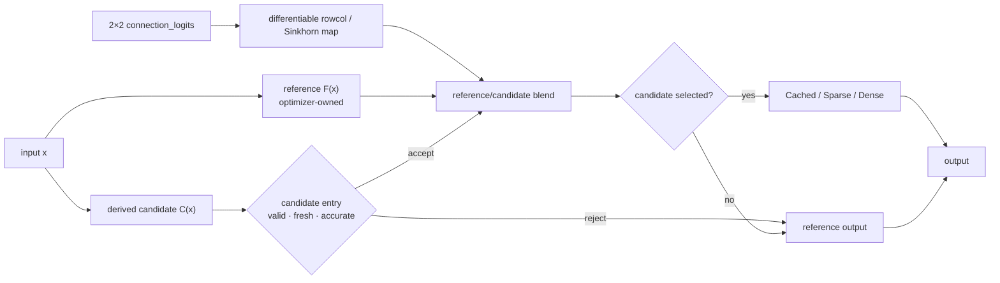
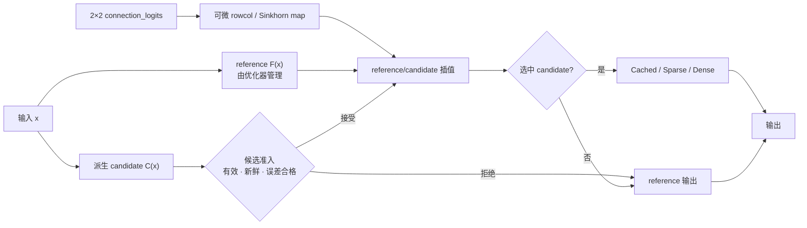

# Talos-XII

[](https://github.com/zayokami/Talos-XII/actions/workflows/ci.yml)
[](https://www.rust-lang.org)
[](https://opensource.org/licenses/MIT)

**A Rust-developed deep learning framework.**

---

Many simulation tools rely on fixed stochastic rules. Talos-XII can additionally run policy-adjusted experiments.

Before a model-driven simulation, Talos-XII loads or trains EnvNet, NeuralLuckOptimizer, DQN, and PPO. EnvNet derives synthetic environment features, while DQN and PPO select one of five discrete modifiers under a bounded budget. These models do not decide whether to execute a task or wait; they redistribute configured parameters inside the simulator. Results therefore describe the selected simulation policy, not external system behavior.

Talos-XII is a reusable Rust library, a CLI application built on that library, and an optional Python extension. The framework provides typed tensors, reverse-mode autograd, neural-network modules, Transformer/MLA components, ACHF layers, CPU SIMD kernels, and optional CUDA kernels. The simulator is a production application and benchmark workload for the framework rather than the framework's only interface.

---

**由Rust开发的深度学习框架。**
Talos-XII 在模型驱动运行前加载或训练 EnvNet、NeuralLuckOptimizer、DQN 和 PPO。EnvNet 生成合成环境特征，DQN 与 PPO 在受限预算内选择五种离散修正动作；结果描述所选模拟策略，不代表外部系统行为。

---

## System Requirements

A CPU-only build runs out of the box on Windows 10+, macOS 11+, and Linux (x86_64 / ARM64, including Apple Silicon and Raspberry Pi). GPU acceleration is optional and requires an NVIDIA GPU (CC 7.5+) with CUDA Toolkit 12.0+.

See **[docs/REQUIREMENTS.md](docs/REQUIREMENTS.md)** for full minimum/recommended specs and per-platform details (runtime deps, SIMD, terminals).

---

## Quick Start

**Build Requirements:** Rust 1.89.0+, 16GB RAM recommended for compilation. CPUs with AVX2 yield best runtime performance.

```bash
git clone https://github.com/zayokami/Talos-XII.git
cd Talos-XII
cargo build --release
./target/release/talos_xii
```

On first launch, the program trains EnvNet, NeuralLuckOptimizer, DQN, and PPO using the schedules in `data/config.json`, taking ~30–45 seconds with the shipped configuration. Models are cached beside the running executable as `env_net.cache`, `neural.cache`, `dqn.cache.bin`, and `ppo.cache.bin`; BF16 inference caches are written to `dqn.cache.bf16.bin` and `ppo.cache.bf16.bin`. Subsequent launches complete in under 1 second.

### CUDA Support (Optional)

Ensure you have an NVIDIA GPU with CC 7.5+ and CUDA Toolkit 12.0+ installed.

```bash
cargo check --features cuda
cargo run --features cuda -- simulate -n 1000 -p 100
```

The default release build is a fat binary containing native SASS for `sm_75`,
`sm_80`, `sm_86`, and `sm_89`, plus `compute_89` PTX for forward-compatible
JIT. Override the complete target set with `CUDA_ARCH` when building a
hardware-specific package:

```bash
CUDA_ARCH=sm_86 cargo check --features cuda
CUDA_ARCH="sm_86,sm_89" cargo build --release --features cuda
```

Numerically safer CUDA math is the default. `CUDA_FAST_MATH=1` explicitly opts
into NVCC fast-math transformations. `NVCC`, `CUDA_PATH`/`CUDA_HOME`,
`CUDA_LIB_DIR`, and `MSVC_BIN_DIR` are supported build overrides; invalid or
missing toolchain paths are hard build errors.

Control device selection in `data/config.json` via the `device` field:
- `cpu` — force CPU
- `cuda` — request CUDA; initialization failure is reported before CPU fallback
- `auto` — auto-detect, prefer CUDA

Initialization may fall back before training starts. Forward operators retain
explicit CPU fallback paths and increment stage-specific counters. GPU Adam is
different: after a training step begins, any allocation, transfer, clipping, or
kernel error aborts training, poisons the optimizer, and prevents the failed
state from being saved. It never retries a potentially partial update on CPU.
`device=cpu` disables CUDA replay mirrors, uploads, and policy migration.

Run the production self-test after installation or on a new driver:

```bash
cargo run --features cuda -- doctor
cargo run --features cuda -- doctor --json
```

`doctor` reports the requested and actual device, GPU name, compute capability,
free/total memory, NVCC version, compiled SASS/PTX targets, and
attempt/success/fallback counters. It executes and numerically checks CUDA
matmul, GELU, log-softmax, backward, and Adam; any fallback during those checks
is a failure, not a pass.

---

## Usage

All subcommands support `-c <path>` for config, `-s <seed>` for repeatable runs with a fixed config and worker topology, and `-f` to force model retraining. Common entry points:

```bash
cargo run --release                              # interactive mode
cargo run --release -- simulate -n 1000 -p 100   # batch simulation
cargo run --release -- benchmark                  # quick built-in benchmark
cargo run --release -- config validate            # strict config validation
cargo run --release -- doctor                     # build/device diagnostics
```

See **[docs/USAGE.md](docs/USAGE.md)** for the full command reference — interactive commands, the optional Python (PyO3) scripting bridge, data collection & model calibration, and the paper-grade ACHF benchmark suite.

---

## Model Parameter Configuration

Configuration is documented in the `_comment` fields of **[data/config.json](data/config.json)**, covering model architecture, training, worker, and ACHF parameters. Parsing is strict: unknown fields, invalid enum strings, wrong JSON types, invalid probabilities/dimensions, incompatible ACHF modes, and cross-field invariant violations return a non-zero exit code. Only `_comment*` documentation fields are ignored. Relative resource and cache paths are resolved from the configuration file's directory. The shipped config and pool catalog are embedded so the default executable remains bootstrappable when external data files are absent.

---

## Framework APIs

Use the Rust library directly:

```rust
use talos_xii::prelude::*;

let input = Tensor::new_f32(vec![1.0, 2.0, 3.0, 4.0], vec![2, 2]);
let layer = Linear::new(2, 3, true, 42);
let loss = layer.forward(&input).gelu().mean();
loss.backward();
```

The stable entry points re-export `Tensor`, `Device`, `Dtype`, `Module`,
`Linear`, `RMSNorm`, Transformer/MLA types, `AchfLayer`, configuration types,
and CUDA diagnostics.

For an installable Python extension (Python 3.9+ abi3):

```bash
python -m pip install maturin
maturin develop --release
python -c "import talos_xii as tx; print(tx.ones([2]).to_list())"
```

The existing embedded interpreter remains available through
`cargo run --features python -- python <script> -- <args>`. CPU wheels are the
portable default. A CUDA Python build must be built on a CUDA 12 toolchain with
`maturin build --release --features cuda`; NVIDIA runtime libraries are not
bundled into the wheel.

Tagged releases produce Windows ZIP, Linux/macOS `tar.gz`, a Linux CUDA 12
archive, abi3 wheels, per-artifact `.sha256` files, and an aggregate
`SHA256SUMS`. Native archives contain the binary, README, license, docs, and
example config/pool files.

---

## Architecture

### Simulation Engine (`src/sim.rs`)

Each simulation constructs a 32-dimensional feature vector (state, environment noise, history, engineered interaction terms, etc.) and feeds it to the neural network for decision guidance. Three modes:
- **probability** — historical name for the NeuralLuckOptimizer path; it predicts a bounded luck modifier and is not an unmodified probability baseline
- **dqn** — Dueling Q-Network selects one of five discrete luck modifiers
- **ppo** — Actor-Critic with sequence context selects from the same discrete modifier set

The engine also supports a fast inference path (`fast_inference`) that skips full Tensor construction during batch simulation, using precompiled prediction functions and KV caching to minimize overhead.

### Neural Networks

On first run, four components are trained or loaded sequentially:

1. **EnvNet** (5→64→32→16→2) — models environment noise/bias from random inputs, state, and history; samples (env_noise, env_bias) per simulation as environment parameters
2. **NeuralLuckOptimizer** — evolutionary training + linear regression + manifold RL on EnvNet-provided environment; learns 32-dim → "luck value" mapping
3. **DQN** (Dueling, 50k steps) — maps state to Q-values over five discrete luck modifiers
4. **PPO** (Actor-Critic + MLA Transformer) — learns a categorical policy over the same five modifiers with sequence context; its schedule is controlled by `ppo_total_steps`

Model cache manifests fingerprint luck-budget, architecture, training, feature, and ACHF settings. Calibrated parameters are applied before this fingerprint is computed. Changes to these settings rebuild incompatible caches on the next initialization. Use `-f` to force retraining.

### ACHF (Adaptive Cache-aware Hyper-Connections)

ACHF replaces selected dense `Linear` layers with three explicitly separated decisions. The trainable dense `weight` remains the **reference operator** and is updated only by the optimizer; derived candidate refreshes and connection constraints never overwrite it.

1. **Reference/candidate quality selection.** A sparse or low-rank candidate is derived from the current reference. The live gate is a reference coefficient: `1` means reference-only. When a candidate is eligible, its effective share is `(1 - reference_gate) * connection_candidate_weight`, and the output is a reference/candidate blend. An absent, stale, or ineligible candidate always falls back to the reference. This formula applies to the soft `last`/`g_min` inference modes; `infer_gate=candidate` hard-selects an admitted candidate, while `infer_gate=reference` hard-selects the reference. `fixed_*` remains an explicitly labeled diagnostic override that also bypasses admission.
2. **Dedicated connection map.** A separate trainable `2×2 connection_logits` tensor controls the cross-connection. `rowcol` or `sinkhorn` produces a differentiable constrained map during forward; Adam moments stay attached to the unconstrained logits. `lambda_ortho` is allowed only with `proj_mode=none`, so incompatible constraints are never stacked on one tensor.
3. **Candidate execution routing.** Only after quality selection chooses the candidate does ACHF select its physical implementation. Cached, Sparse, and Dense are execution layouts for the same candidate, not quality branches and not gate values.



Candidate modes are mutually exclusive:

- `candidate_mode=sparse` uses deterministic magnitude-percentile pruning when `candidate_target_sparsity > 0`; equal magnitudes are resolved by stable parameter index. `prune_threshold` remains the legacy absolute-threshold mode when the target is zero.
- A normal sparse candidate is calibrated after reference training with a separate Adam optimizer and real PPO rollout states. The reference is frozen; the sparse mask applies to forward values and gradients, and masked weights plus both Adam moments must remain exactly zero.
- With `candidate_min_calibration_samples > 0`, production admission uses held-out candidate-output error (`candidate_max_output_relative_error`), realized sparsity, a valid mask, zero-mask optimizer invariants, and economical CSR storage. Weight Frobenius error remains diagnostic. A zero minimum sample count enables the legacy weight-error rule.
- `candidate_mode=low_rank` applies only `rank`. It does not prune and does not expose a Sparse route. The current approximation is materialized densely, so rank is not claimed as factorized storage or a low-rank kernel speedup.
- `candidate_mode=none` keeps reference-only behavior.

`candidate_refresh_freq` controls post-optimizer candidate rebuilding. A skipped refresh immediately revokes production eligibility until the next rebuild, preventing stale candidates from being reused. After calibration, `freeze_for_inference()` preserves the candidate only while its complete reference fingerprint still matches; otherwise it rebuilds and revokes stale calibration.

`candidate_train_from_scratch=true` is reserved for the fixed-mask sparse-training scientific baseline. It gives the candidate—not the reference—to the policy optimizer from initialization and is not the production prune-and-calibrate path.

Frozen output memoization is separate from Cached execution. It hashes every input element and also compares the complete stored input before returning a memoized output. Benchmarks disable it unless memoization itself is under study, so selector/path counters remain interpretable. `cache_min_reuse` controls only this memo threshold; AMA warm-up and hysteresis use the independent `path_warmup_samples` and `path_min_dwell` settings.

**Recommended starting point:** `candidate_mode=sparse`, `candidate_target_sparsity=0.51`, `candidate_calibration_steps=256`, `candidate_refresh_freq=1`, `proj_mode=sinkhorn`, `mode=lite`, and `apply_ffn=true`. Calibration stops early only after every layer satisfies the held-out output-error target. The 50% point remains a structural rejection control because CSR row pointers make it larger than dense storage; higher sparsities stay visible in the admission frontier and fall back to reference unless every production criterion passes. Treat every `fixed_*` mode as a diagnostic override.

The paper benchmark includes a real-weight admission frontier, prune-and-calibrate and fixed-mask sparse-training baselines, time-resolved output discrepancy, and masked Adam invariants. `cargo run --release -- benchmark paper --trials 5 --processes 3` runs three independent OS processes; the parent verifies every child manifest and computes confidence intervals over process means. Submission readiness is blocked when tracked source differs from the recorded commit. Cross-hardware replication remains a separate external requirement.

### AMA

AMA is the latency scheduler inside the third layer. It runs only after the quality layer has selected an eligible candidate (except explicit `fixed_*` diagnostics). Its paths are:

- **Cached** — a prepared dense candidate buffer with the fused CPU row kernel.
- **Sparse** — the sparse candidate's CSR/masked kernel; available only for a valid sparse candidate.
- **Dense** — the same candidate through its ordinary dense `Linear` implementation.

`lite` uses deterministic routing: Cached when its shape/row/input-density conditions hold, otherwise Sparse when available, otherwise Dense. `plain_ema` and `full` sample path latency; `full` additionally uses cold/warm and short/long EMAs, per-batch buckets, stale probing, hysteresis, and bounded loser re-probing. A low-rank candidate is compared only across Cached and Dense; AMA never fabricates or probes a Sparse arm for it.

Metrics report the layers separately: memo hits, reference/candidate selections, candidate rejections, and Cached/Sparse/Dense rates within candidate executions. This prevents an output memo hit or reference fallback from being misreported as a cache-layout win.

### SIMD Acceleration (`src/simd.rs`)

Runtime CPU capability detection with automatic dispatch: Scalar → AVX2 → AVX2+FMA → AVX-512F on x86_64; NEON on ARM. Operations: vector dot product, scaled row accumulation, FMA, ReLU, Softmax. Build-time `-C target-cpu=native` in `.cargo/config.toml` enables all instruction sets available on the current CPU.

### Tech Stack

- **Rust** — language and core framework
- **Rayon** — data parallelism
- **Portable SIMD** — AVX2 / AVX-512 / NEON hardware acceleration
- **Custom Neural Networks** — EnvNet, PPO (MLA Transformer), DQN (Dueling), NeuralLuckOptimizer
- **Custom Autograd** — automatic differentiation engine supporting matmul, conv2d, pool
- **Mmap Tensor I/O** — memory-mapped high-performance tensor I/O

---

## Testing

```bash
cargo test
cargo test --features python
cargo test --features cuda
cargo clippy --all-targets -- -D warnings
cargo package --locked
```

Covers: state-transition logic, parameter validation, DQN/Q-value validation, PPO fast/slow alignment, Actor-Critic shapes, ACHF consistency, Transformer MLA/RoPE/RMSNorm, binary codec, config parsing, Beta calibration, EnvNet serialization/training, autograd gradient checks, and more.

CI runs on Ubuntu, Windows, and macOS, validates MSRV and ARM64 cross
compilation, builds the Python extension, compiles CUDA in a CUDA 12 container,
and supports opt-in runtime tests on a self-hosted GPU runner.

---

## Contributing

Code follows [Conventional Commits](https://www.conventionalcommits.org/) format (`feat:`, `fix:`, `docs:`, etc.). Run `cargo fmt` and `cargo clippy -- -D warnings` before committing.

Workflow: Fork → create `feature/*` from `dev` → develop and pass `cargo test` → PR to `dev`. Code Review and CI required.

Branch strategy: `main` is production (merged from release/hotfix only), `dev` is development, `feature/*` is branched from dev, `release/v*` for releases, `hotfix/*` for urgent fixes.

---

## FAQ

**Why is first launch so slow?**
Training EnvNet, NeuralLuckOptimizer, DQN, and PPO models takes ~30–45 seconds. Results are cached; subsequent launches take under 1 second. Enable `fast_init` in config to use shorter training settings during development.


**Can I delete the cache files?**
Yes. These files are stored beside the executable by default. Deleting `env_net.cache`, `neural.cache`, `dqn.cache.bin`, or `ppo.cache.bin` triggers retraining for the corresponding model on next run. Deleting `dqn.cache.bf16.bin` or `ppo.cache.bf16.bin` only rebuilds the BF16 inference cache from the master model. Usually only needed when model architecture, feature construction, or training configuration changes.

---

## References

- *DeepSeek mHC: Manifold-Constrained Hyper-Connections* — early prototype reference (ACHF has since diverged to its own design)
- *Proximal Policy Optimization Algorithms* (OpenAI) — PPO algorithm
- *Embarrassingly Simple Self-Distillation Improves Code Generation* — self-distillation for EMA teacher updates and Best-K Sampling

---

## Disclaimer

This software is provided "as is," without warranty of any kind, express or implied, including but not limited to warranties of merchantability, fitness for a particular purpose, and non-infringement. In no event shall the authors or copyright holders be liable for any claim, damages, or other liability, whether in an action of contract, tort, or otherwise, arising from, out of, or in connection with the software or the use or other dealings in the software.

---

---

## 系统要求

纯 CPU 版在 Windows 10+、macOS 11+、Linux（x86_64 / ARM64，含 Apple Silicon 与树莓派）上开箱即用。GPU 加速为可选项，需要计算能力 7.5+ 的 NVIDIA GPU 和 CUDA Toolkit 12.0+。

完整的最低/推荐配置和各平台详细说明（运行时依赖、SIMD、终端）见 **[docs/REQUIREMENTS.md](docs/REQUIREMENTS.md)**。

---

## 快速开始

**编译要求：** Rust 1.89.0+，建议 16GB 内存用于编译。支持 AVX2 的 CPU 运行时性能最佳。

```bash
git clone https://github.com/zayokami/Talos-XII.git
cd Talos-XII
cargo build --release
./target/release/talos_xii
```

首次启动会按 `data/config.json` 中的训练计划训练 EnvNet、NeuralLuckOptimizer、DQN 和 PPO；随附配置约需 30～45 秒。模型默认缓存到运行中的 exe 所在目录，文件名为 `env_net.cache`、`neural.cache`、`dqn.cache.bin`、`ppo.cache.bin`；BF16 推理缓存写入 `dqn.cache.bf16.bin` 和 `ppo.cache.bf16.bin`，之后启动不到 1 秒。

### CUDA 支持（可选）

确保拥有计算能力 7.5+ 的 NVIDIA GPU 并已安装 CUDA Toolkit 12.0+。

```bash
cargo check --features cuda
cargo run --features cuda -- simulate -n 1000 -p 100
```

默认发布构建是 fat binary：包含 `sm_75`、`sm_80`、`sm_86`、`sm_89`
原生 SASS，并附带 `compute_89` PTX 供新架构向前兼容 JIT。只有制作特定硬件
包时才建议用 `CUDA_ARCH` 覆盖完整目标集合：

```bash
CUDA_ARCH=sm_86 cargo check --features cuda
CUDA_ARCH="sm_86,sm_89" cargo build --release --features cuda
```

默认不启用 NVCC fast math；只有显式设置 `CUDA_FAST_MATH=1` 才接受其数值
语义变化。可通过 `NVCC`、`CUDA_PATH`/`CUDA_HOME`、`CUDA_LIB_DIR`、
`MSVC_BIN_DIR` 覆盖工具链位置，路径缺失或非法会直接导致构建失败。

在 `data/config.json` 中通过 `device` 字段控制设备：
- `cpu` — 强制 CPU
- `cuda` — 请求 CUDA；初始化失败会明确报告后再回退 CPU
- `auto` — 自动探测，优先 CUDA

训练开始前允许初始化级 CPU 回退；前向算子保留带分阶段计数器的 CPU fallback。
GPU Adam 不允许这样处理：训练步一旦开始，分配、传输、裁剪或 kernel 任一失败
都会中止训练并将优化器标记为 poisoned，失败状态不会写入缓存，也不能在 CPU
上重试可能已经部分更新的参数。`device=cpu` 会关闭 replay mirror、batch 上传
和策略迁移。

部署或更换驱动后运行：

```bash
cargo run --features cuda -- doctor
cargo run --features cuda -- doctor --json
```

`doctor` 会报告请求/实际设备、GPU 名称、计算能力、空闲/总显存、NVCC 版本、
编译架构和成功/fallback 计数，并真实校验 matmul、GELU、log-softmax、backward
与 Adam。自检过程中出现 fallback 会判定失败，不会当作 CUDA 正常。

---

## 使用方法

所有子命令支持 `-c <path>` 指定配置、`-s <seed>` 在配置和 worker 拓扑不变时复现实验、`-f` 强制重训模型。常用入口：

```bash
cargo run --release                              # 交互模式
cargo run --release -- simulate -n 1000 -p 100   # 批量模拟
cargo run --release -- benchmark                  # 快速内置基准
cargo run --release -- config validate            # 严格配置校验
cargo run --release -- doctor                     # 构建与设备诊断
```

完整命令参考见 **[docs/USAGE.md](docs/USAGE.md)** —— 交互指令、可选的 Python（PyO3）脚本桥接、数据采集与模型校准，以及论文级 ACHF Benchmark 套件。

---

## 模型参数配置

模型参数集中记录在 **[data/config.json](data/config.json)** 的 `_comment` 字段中，涵盖模型结构、训练、线程和 ACHF 参数。配置解析是严格的：未知字段、非法枚举、错误 JSON 类型、非法概率/维度、不兼容 ACHF 组合和跨字段约束都会返回非零退出码；只有 `_comment*` 文档字段会被忽略。相对路径以配置文件所在目录为基准。默认配置和卡池目录嵌入二进制，外部默认数据缺失时仍可启动。

---

## 框架 API

Rust 用户可直接引用 `talos_xii::prelude::*`，稳定入口导出 `Tensor`、`Device`、
`Dtype`、`Module`、`Linear`、`RMSNorm`、Transformer/MLA、`AchfLayer`、
配置类型和 CUDA 诊断。

Python 3.9+ 可构建 abi3 wheel：

```bash
python -m pip install maturin
maturin develop --release
python -c "import talos_xii as tx; print(tx.ones([2]).to_list())"
```

原有嵌入式入口仍保留：
`cargo run --features python -- python <script> -- <args>`。通用预编译 wheel
默认是 CPU 版；CUDA Python 包必须在 CUDA 12 工具链上执行
`maturin build --release --features cuda`，wheel 不捆绑 NVIDIA 运行库。

版本标签发布会生成 Windows ZIP、Linux/macOS `tar.gz`、Linux CUDA 12 包、
abi3 wheel、每个制品的 `.sha256` 与汇总 `SHA256SUMS`。原生包包含二进制、
README、许可证、文档和示例配置。

---

## 技术架构

### 模拟引擎（`src/sim.rs`）

每次模拟构建 32 维特征向量（状态、环境噪声、历史信息以及工程化交互特征等），送入神经网络获取决策建议。三种模式：
- **probability** — NeuralLuckOptimizer 路径的历史名称；它会预测受运势预算约束的修正值
- **dqn** — Dueling Q-Network 从五种离散运势修正动作中选择
- **ppo** — 带序列上下文的 Actor-Critic 从同一组离散修正动作中选择

引擎还支持快速推理路径（`fast_inference`），批量模拟时跳过完整 Tensor 构建，使用预编译快速预测函数和 KV 缓存压缩推理开销。

### 神经网络

初始化时依次训练或加载四个组件：

1. **EnvNet**（5→64→32→16→2）— 基于随机输入、状态与历史信息建模环境噪声/偏置，每次模拟采样一组 (env_noise, env_bias) 作为环境参数
2. **NeuralLuckOptimizer** — 在 EnvNet 提供的环境上做进化训练、线性回归与流形 RL 优化，学习 32 维特征到"运气值"的映射
3. **DQN**（Dueling，50k 步）— 将状态映射为五种离散运势修正动作的 Q 值
4. **PPO**（Actor-Critic + MLA Transformer）— 利用序列上下文学习同一组五种修正动作上的分类策略，训练计划由 `ppo_total_steps` 控制

模型缓存清单会对运势预算、模型结构、训练参数、特征和 ACHF 设置生成指纹，校准参数会在计算该指纹前应用。上述设置变化时，下次初始化会重建不兼容缓存。使用 `-f` 可强制重训。

### ACHF（Adaptive Cache-aware Hyper-Connections）

ACHF 把被替换的稠密 `Linear` 明确拆成三层决策。可训练的稠密 `weight` 始终是 **reference 算子**，只允许优化器更新；候选重建和连接约束都不会覆盖它。

1. **reference/candidate 质量选择。** 系统从当前 reference 派生稀疏或低秩 candidate。实时 gate 表示 reference 系数，`1` 即纯 reference。候选合格时，有效候选占比为 `(1 - reference_gate) * connection_candidate_weight`，输出是 reference/candidate 插值；候选缺失、陈旧或不合格时强制回退 reference。该公式用于 `last`/`g_min` 软门控；`infer_gate=candidate` 会硬选择已通过准入的 candidate，`infer_gate=reference` 会硬选择 reference。`fixed_*` 仍是明确标注且会额外绕过准入的诊断覆盖。
2. **专用连接图。** 独立可训练的 `2×2 connection_logits` 控制跨连接。`rowcol`/`sinkhorn` 在前向中可微地派生受约束 connection map，Adam 动量始终绑定未投影 logits。`lambda_ortho` 只允许与 `proj_mode=none` 搭配，不会在同一个张量上叠加冲突约束。
3. **candidate 执行路由。** 只有质量层选中 candidate 后，才在 Cached、Sparse、Dense 之间选择物理实现。这三者是同一个 candidate 的执行布局，不是质量分支，也不是 gate 值。



候选模式严格互斥：

- `candidate_mode=sparse` 在 `candidate_target_sparsity > 0` 时使用确定性的 magnitude percentile；幅值相同按参数索引稳定裁决。目标为零时才使用兼容的绝对阈值 `prune_threshold`。
- 正常 sparse candidate 会在 reference 训练完成后，用独立 Adam 和真实 PPO rollout 状态校准；reference 冻结，mask 同时约束前向、梯度、权重和 Adam 一二阶矩。
- 当 `candidate_min_calibration_samples > 0` 时，生产准入要求留出集输出误差不超过 `candidate_max_output_relative_error`、实际稀疏率达标、mask 有效、被 mask 的权重/矩严格为零且 CSR 存储经济。权重 Frobenius 误差仅作诊断。
- `candidate_mode=low_rank` 只使用 `rank`，不剪枝，也没有 Sparse 路由。当前近似仍以稠密矩阵物化，因此不能把 rank 宣称为因子化存储或低秩核加速。
- `candidate_mode=none` 始终使用 reference。

`candidate_refresh_freq` 控制优化器更新后的候选重建。跳过刷新会立刻撤销生产准入。校准完成后，`freeze_for_inference()` 只有在完整 reference 指纹仍匹配时才保留校准候选，否则会重建并撤销陈旧校准。

`candidate_train_from_scratch=true` 只用于固定 mask 从初始化开始训练的科学基线；策略优化器持有 candidate，reference 不参与其优化，不能与生产的“剪枝后校准”混称。

冻结输出 memo 与 Cached 执行是两回事。memo 哈希覆盖全部输入元素，并在返回前比较完整输入；论文 benchmark 默认关闭 memo，避免污染 selector 与路径统计。`cache_min_reuse` 只控制 memo 阈值；AMA 预热和滞回分别由独立的 `path_warmup_samples`、`path_min_dwell` 控制。

**推荐起步：** `candidate_mode=sparse`、`candidate_refresh_freq=1`、`proj_mode=sinkhorn`、`mode=lite`、`apply_ffn=true`。所有 `fixed_*` 模式都是诊断覆盖：即使候选不满足生产准入，也会强制选择候选。

论文 benchmark 现包含真实训练权重的准入前沿、剪枝后校准与固定 mask 从零稀疏训练基线、随校准步变化的输出误差和 Adam mask 一致性诊断。`cargo run --release -- benchmark paper --trials 5 --processes 3` 会运行 3 个真正独立的 OS 进程；父进程校验每个子 manifest，并以进程均值汇总置信区间。跨硬件复现仍是单独的外部条件。

### AMA

AMA 是第三层内部的延迟调度器。正常情况下，只有质量层已经选中合格 candidate 后才会运行（`fixed_*` 诊断除外）。三条路径是：

- **Cached** — 预备好的稠密 candidate 缓冲区和融合 CPU 行核。
- **Sparse** — 稀疏 candidate 的 CSR/mask 内核；仅对有效稀疏候选可用。
- **Dense** — 同一个 candidate 的普通稠密 `Linear` 实现。

`lite` 使用确定性路由：满足形状、行数和输入密度条件时走 Cached，否则有 Sparse 就走 Sparse，再否则走 Dense。`plain_ema` 与 `full` 会采样候选内部路径延迟；`full` 额外使用冷/热、短/长 EMA、按 batch 分桶、陈旧探测、滞回和有上限的失败路径重探测。低秩 candidate 只比较 Cached 与 Dense，AMA 不会伪造或探测 Sparse 路径。

指标也按三层拆分：输出 memo 命中、reference/candidate 选择、candidate 拒绝，以及 candidate 内部 Cached/Sparse/Dense 比例。这样 memo 命中或 reference 回退不会再被冒充为缓存执行胜利。

### SIMD 加速（`src/simd.rs`）

运行时 CPU 能力检测，自动选择最优指令集：x86_64 上为 Scalar → AVX2 → AVX2+FMA → AVX-512F；ARM 上为 NEON。涵盖向量点积、缩放行累加、FMA、ReLU、Softmax 等常见运算。构建时 `.cargo/config.toml` 中 `-C target-cpu=native` 启用当前 CPU 所有可用指令集。

### 技术栈

- **Rust** — 语言与核心框架
- **Rayon** — 数据并行
- **Portable SIMD** — AVX2 / AVX-512 / NEON 硬件加速
- **自研神经网络** — EnvNet、PPO（MLA Transformer）、DQN（Dueling）、NeuralLuckOptimizer
- **自研 Autograd** — 支持 matmul、conv2d、pool 的自动微分引擎
- **Mmap Tensor I/O** — 内存映射的高性能张量读写

---

## 测试

```bash
cargo test
cargo test --features python
cargo test --features cuda
cargo clippy --all-targets -- -D warnings
cargo package --locked
```

覆盖：状态转移逻辑、严格配置、DQN/PPO、GPU optimizer 故障注入、ACHF、
Transformer、autograd 与发布契约等。CI 在 Ubuntu、Windows、macOS 上执行，
验证 MSRV/ARM64、Python extension、CUDA 12 编译，并可在 self-hosted GPU
runner 上执行真实 CUDA 自检。

---

## 贡献

代码遵循 [Conventional Commits](https://www.conventionalcommits.org/) 格式。提交前请确保通过 `cargo fmt` 和 `cargo clippy -- -D warnings`。

开发流程：Fork → 从 `dev` 创建 `feature/*` 分支 → 开发并通过 `cargo test` → 向 `dev` 发起 PR，需要通过 Code Review 与 CI。

分支规范：`main` 为生产分支，`dev` 为开发分支，`feature/*` 从 dev 检出，`release/v*` 用于发布，`hotfix/*` 用于紧急修复。

---

## 常见问题

**首次启动为什么要等很久？**
需要训练 EnvNet、NeuralLuckOptimizer、DQN、PPO 四个模型。完成后写入缓存，之后启动不到 1 秒。开发调试可开启配置中的 `fast_init` 使用更短的训练设置。


**可以删除缓存文件吗？**
可以。缓存文件默认在 exe 所在目录。删除 `env_net.cache`、`neural.cache`、`dqn.cache.bin` 或 `ppo.cache.bin` 后，下次运行会重训对应模型。删除 `dqn.cache.bf16.bin` 或 `ppo.cache.bf16.bin` 只会从主模型重建 BF16 推理缓存。一般只在模型结构、特征构造或训练配置变化时才需要清缓存。

---

## 引用论文

- *DeepSeek mHC: Manifold-Constrained Hyper-Connections* — 早期原型参考来源之一（ACHF已发展为独立设计）
- *Proximal Policy Optimization Algorithms* (OpenAI) — PPO 算法
- *Embarrassingly Simple Self-Distillation Improves Code Generation* — 自蒸馏技术，用于 EMA teacher 更新和 Best-K Sampling

---

## 免责声明

本软件按“原样”提供，不作任何形式的明示或暗示保证，包括但不限于适销性、特定用途的适用性和不侵权的保证。在任何情况下，无论是因为合同、侵权或其他原因，只要是由本软件、本软件的使用或其他与本软件有关的活动引起的索赔、损害赔偿或其他责任，作者或版权持有人均不承担任何责任。

---
**Copyright 2026 zayoka.**

Contact: into@zayoka.com
